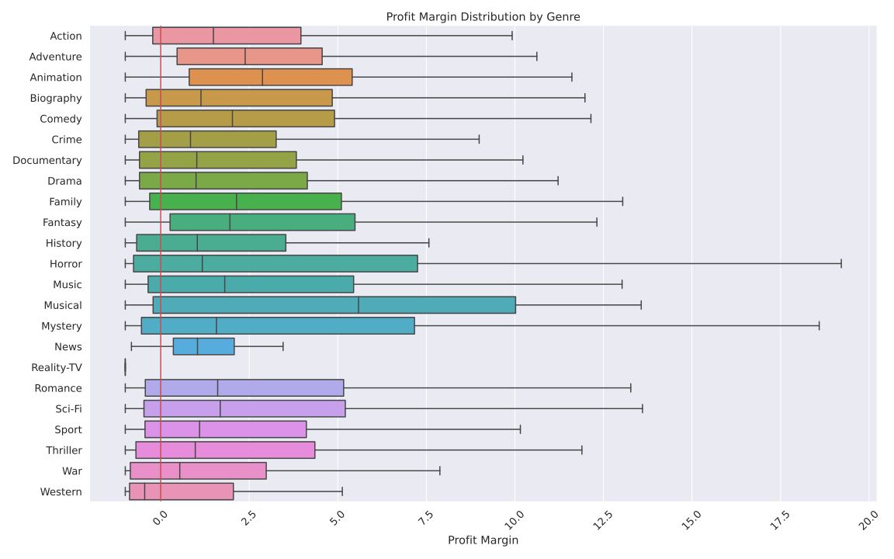

# Movie Industry Insights

This project was completed as part of Flatiron School's Data Science Bootcamp.

Follow the quick start guide if you'd like to expand/extend/inspect my work
on your local machine.

Or you can read on further to get an overview of this project and my findings.

## Quick Start Guide

1. Clone this repository

```shell
$ git clone https://github.com/Skellet0r/movie-industry.git
```

2. Enter directory & Initialize conda environment

```shell
$ cd ./movie-industry
$ conda env create -f environment.yml
```

3. Activate conda environment

```shell
$ conda activate movie-industry
```

4. Enjoy

## Components

- [Data](data/): the raw and cleaned data used for this project can
  be found in the data directory.
- [Notebooks](notebooks/): the notebooks created throughout this
  project can be found in the notebooks directory and are ordered
  by creation time.
- [Presentation](https://Skellet0r.github.io/movie-industry): the
  presentation delivered to our client is hosted on github pages and uses
  [reveal.js](https://revealjs.com/). A pdf version of the presentation can
  also be found in this repository by clicking [here](presentation.pdf).
- [Charter](docs/project/charter.md): The project charter is a guideline
  for this project and gives stakeholders/collaborators a business understanding
  as well as an idea of how this project is to develop. 

## Technologies Used

- [Jupyter](https://jupyter.org/): for interactive notebooks
- [Reveal.js](https://revealjs.com/): for creating html slide decks
- [Python](https://www.python.org/): for data cleaning and analysis

## Background

Microsoft ("the client") is seeking to enter the Movie Industry. The client has come to us for insight on what type of films are doing best at the box office.

Our goal is to identify and recommend actionable steps our client can take
in order to produce profitable movies.

## Findings

1. Produce Animation Movies they are less risky as shown by the fact that
   more than 75% of them are profitable. One thing to note is that it isn't
   uncommon for movies to be unprofitable in any genre, the risk still exists
   however the Animation genre appears to be least riskiest based on our
   data.



2. Have a budget between 94-130 million USD. Our data shows that
   animation movies within that budget range are less risky. More
   than 75% of the animation movies within that budget range have
   a profit.


3. Have a total movie runtime between 75 and 140 minutes. We follow the
   industry trend here, and a majority of movies appear to fall within that
   large range.


4. Release the feature film sometime in either the month of June or July.
   Our data shows that of movies released after 1999, more than 75% those
   released in the months of June or July returned a profit.
   

