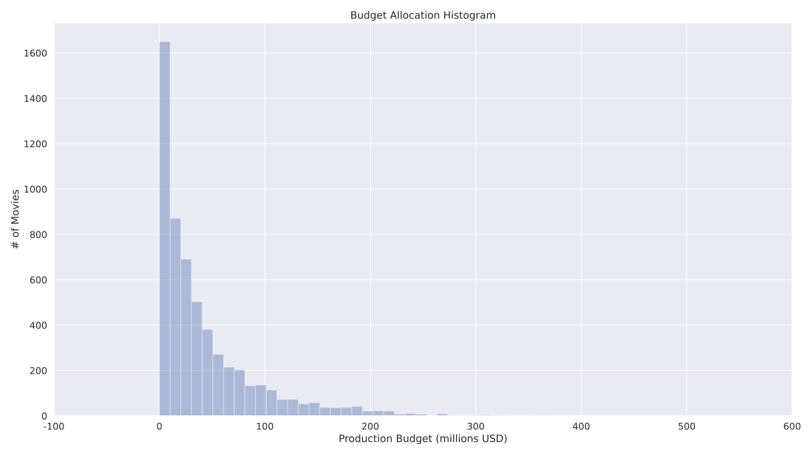

## Movie Industry Insights

Recommendations & Analysis of the Movie Industry <!-- .element: style="font-size: x-large;" -->

---

## Problem Statement

- Movie studio startup <!-- .element: class="fragment" data-fragment-index="1" -->
- Unaware of industry trends  <!-- .element: class="fragment" data-fragment-index="2" -->
- Seeking to develop revenue stream <!-- .element: class="fragment" data-fragment-index="3" -->

Note:
- Our client is a multinational company, with generous business experience.
- Member of the technology industry with no prior experience in the movie/film industry.
- They are looking to make profitable original content that rival competitors in the space.

---

## Business Value

Global movie production has a market size of approx. $103 billion USD. - [IBISWorld](https://www.ibisworld.com/industry-trends/global-industry-reports/other-community-social-personal-service-activities/movie-production-distribution.html)

---

## Methodology

1. Data <!-- .element: class="fragment" data-fragment-index="1" -->
2. Profit Margin <!-- .element: class="fragment" data-fragment-index="2" -->
2. Exploratory Analysis <!-- .element: class="fragment" data-fragment-index="3" -->

Note:
- Our data was given to us by our client, collected from various sources (IMDB, The Numbers, Rotten Tomatoes)
- Aggregated our data, and created our main feature profit margin to do our analysis. This allows us to compare
  our films on an even scale.
- Performed Exploratory Data Analysis, looking for low-risk recommendations.

---

## Recommendations

1. Animation <!-- .element: class="fragment" data-fragment-index="1" -->
2. $94 - $130 million USD budget <!-- .element: class="fragment" data-fragment-index="2" -->
3. 75 - 140 minute runtime <!-- .element: class="fragment" data-fragment-index="3" -->
4. June - July release <!-- .element: class="fragment" data-fragment-index="4" -->

Note:
- Our findings show that although all genres have an inherent risk, the Animation Genre has the least risk with more than 75% of movies being profitable.
- Coupled with our previous recommendation we found that within the Animation genre, movies with a budget between $94 - $130 million USD faired extremely well,
  and it is very common to have profitable movies.
- Looking at all profitable movies, we found that it is best to follow suite and recommend that movies fall between 75 and 140 minute runtime, which appears to be
  an industry standard.
- Looking at the profitability of movies by their release month, we see the months of June and July have a clear advantage over the rest of the year.

--

## Genre Visualizations

--

###### Profit Margin Box and Whisker Plot by Genre 

  

--

###### Lowest Risk Genres Average Profit

  

--

## Budget Allocation Visualizations

--

###### Movie Budget Allocation Histogram

  

--

###### Profit Margin Box and Whisker Plot by Budget (All Movies)

  

--

###### Profit Margin Box and Whisker Plot by Budget (Animation Movies)

  

--

## Runtime Visualizations

--

###### Movie Runtime Histogram

  

--

###### Movie Runtime Histogram (Profitable Movies)

  

--

###### Movie Runtime Histogram (Animation Movies)

  

--

###### Movie Runtime Histogram (Profitable Animation Movies)

  

-- 

## Release Window Visualizations 

--

###### Profit Margin Box and Whisker Plot by Quarter

  

--

###### Profit Margin Box Plot by Month

  

---

## Future Work

1. Casting <!-- .element: class="fragment" data-fragment-index="1" -->
2. Direction <!-- .element: class="fragment" data-fragment-index="2" -->
3. Score <!-- .element: class="fragment" data-fragment-index="3" -->
4. Promotion <!-- .element: class="fragment" data-fragment-index="4" -->

Note:
- Look into the relationship between these 4 variables and the profitablity of a film.
- Having feature cast members
- Having experienced directors vs. amateurs
- Music choice, soundtrack could affect reception
- The amount of advertising and promotional events before the movie's release date.

---

# Thank You